# Diagrame PlantUML - CityScape (Capitolul 2 & 3)

Aici ai codul PlantUML pentru fiecare diagramă din Capitolul 2 (Analiză) și Capitolul 3 (Proiectare), revizuit și completat pentru a acoperi **toate diagramele cerute în structura licenței tale**, respectând normele academice din **seminarele de Proiectarea Sistemelor Informatice (PSI)**.

Poți copia codul din fiecare secțiune (între `@startuml` și `@enduml`) și să îl introduci pe un site precum **[PlantText](https://www.planttext.com/)** sau **[PlantUML Web Server](http://www.plantuml.com/plantuml/uml/)** pentru a genera și descărca diagramele în format vectorial (SVG) sau imagine (PNG).

---

## CAPITOLUL 2: ANALIZA SISTEMULUI (DIAGRAME CONCEPTUALE)

### 2.1 Diagrama Generală a Cazurilor de Utilizare (Use Case Diagram)
* **Reguli respectate din Seminarul 3:**
  * Toate cazurile de utilizare încep **obligatoriu cu un VERB** la modul infinitiv / imperativ.
  * Liniile de asociere dintre actori și cazurile de utilizare **NU au săgeți** (reprezintă căi simple de comunicare).
  * Relațiile `<<include>>` și `<<extend>>` au linii întrerupte cu săgeata orientată corect (spre cazul inclus, respectiv spre cazul de bază).
  * Granița sistemului este marcată prin dreptunghiul sistemului CityScape.

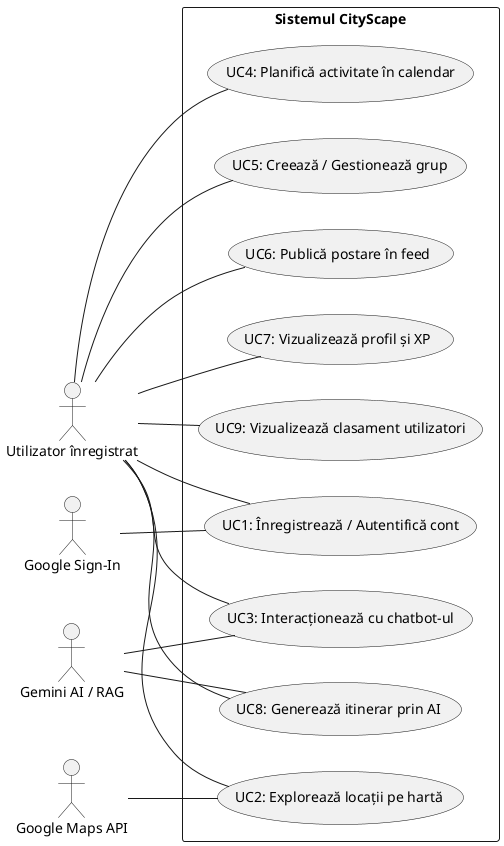
```plantuml
@startuml
left to right direction
skinparam packageStyle rectangle

actor "Utilizator înregistrat" as U
actor "Google Sign-In" as G
actor "Gemini AI / RAG" as AI
actor "Google Maps API" as Maps

package "Sistemul CityScape" {
  usecase "UC1: Înregistrează / Autentifică cont" as UC1
  usecase "UC2: Explorează locații pe hartă" as UC2
  usecase "UC3: Interacționează cu chatbot-ul" as UC3
  usecase "UC4: Planifică activitate în calendar" as UC4
  usecase "UC5: Creează / Gestionează grup" as UC5
  usecase "UC6: Publică postare în feed" as UC6
  usecase "UC7: Vizualizează profil și XP" as UC7
  usecase "UC8: Generează itinerar prin AI" as UC8
  usecase "UC9: Vizualizează clasament utilizatori" as UC9
}

' Relațiile dintre Actori și Cazurile de Utilizare (linii simple, fără săgeți)
U -- UC1
U -- UC2
U -- UC3
U -- UC4
U -- UC5
U -- UC6
U -- UC7
U -- UC8
U -- UC9

G -- UC1
AI -- UC3
AI -- UC8
Maps -- UC2
@enduml
```

---

### 2.2 Diagrama de Clase (Forma Inițială - Analiza Sistemului)
* **Reguli respectate din Seminarul 4:**
  * Folosește denumiri la singular (substantive).
  * Conține stereotipurile standard de analiză: `<<entity>>`, `<<control>>`, `<<boundary>>`.
  * Adaugă atributele conceptuale esențiale cu vizibilitate privată (`-`) și tipuri de date standard.

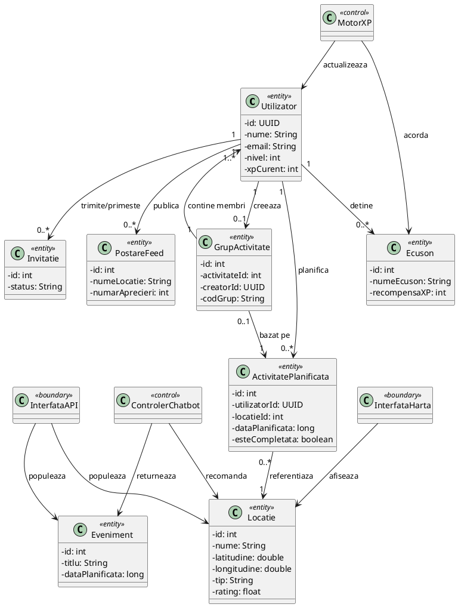
```plantuml
@startuml
skinparam classAttributeIconSize 0

class Utilizator <<entity>> {
  - id: UUID
  - nume: String
  - email: String
  - nivel: int
  - xpCurent: int
}

class Locatie <<entity>> {
  - id: int
  - nume: String
  - latitudine: double
  - longitudine: double
  - tip: String
  - rating: float
}

class ActivitatePlanificata <<entity>> {
  - id: int
  - utilizatorId: UUID
  - locatieId: int
  - dataPlanificata: long
  - esteCompletata: boolean
}

class GrupActivitate <<entity>> {
  - id: int
  - activitateId: int
  - creatorId: UUID
  - codGrup: String
}

class Invitatie <<entity>> {
  - id: int
  - status: String
}

class Eveniment <<entity>> {
  - id: int
  - titlu: String
  - dataPlanificata: long
}

class PostareFeed <<entity>> {
  - id: int
  - numeLocatie: String
  - numarAprecieri: int
}

class Ecuson <<entity>> {
  - id: int
  - numeEcuson: String
  - recompensaXP: int
}

class MotorXP <<control>>
class ControlerChatbot <<control>>

class InterfataHarta <<boundary>>
class InterfataAPI <<boundary>>

Utilizator "1" --> "0..*" ActivitatePlanificata : planifica
Utilizator "1" --> "0..*" PostareFeed : publica
Utilizator "1" --> "0..*" Ecuson : detine
Utilizator "1" --> "0..*" Invitatie : trimite/primeste
Utilizator "1" --> "0..1" GrupActivitate : creeaza

GrupActivitate "1" --> "1..*" Utilizator : contine membri
ActivitatePlanificata "0..*" --> "1" Locatie : referentiaza
GrupActivitate "0..1" --> "1" ActivitatePlanificata : bazat pe

MotorXP --> Utilizator : actualizeaza
MotorXP --> Ecuson : acorda
ControlerChatbot --> Locatie : recomanda
ControlerChatbot --> Eveniment : returneaza
InterfataHarta --> Locatie : afiseaza
InterfataAPI --> Locatie : populeaza
InterfataAPI --> Eveniment : populeaza
@enduml
```

---

### 2.3 Diagramele de Activitate (Analiza Proceselor)

#### A. Diagrama de Activitate - Fluxul de Autentificare
* **Reguli respectate din Seminarul 5:**
  * Toate nodurile de acțiune încep cu **verbe de acțiune** la imperativ / infinitiv.
  * Nodul de start este plasat în stânga-sus.
  * Fluxurile decizionale folosesc **rombul de decizie**, iar toate ramurile de ieșire au **condiții tranzitorii clare, mutual exclusive și complete**, scrise în paranteze pătrate `[condiție]`.

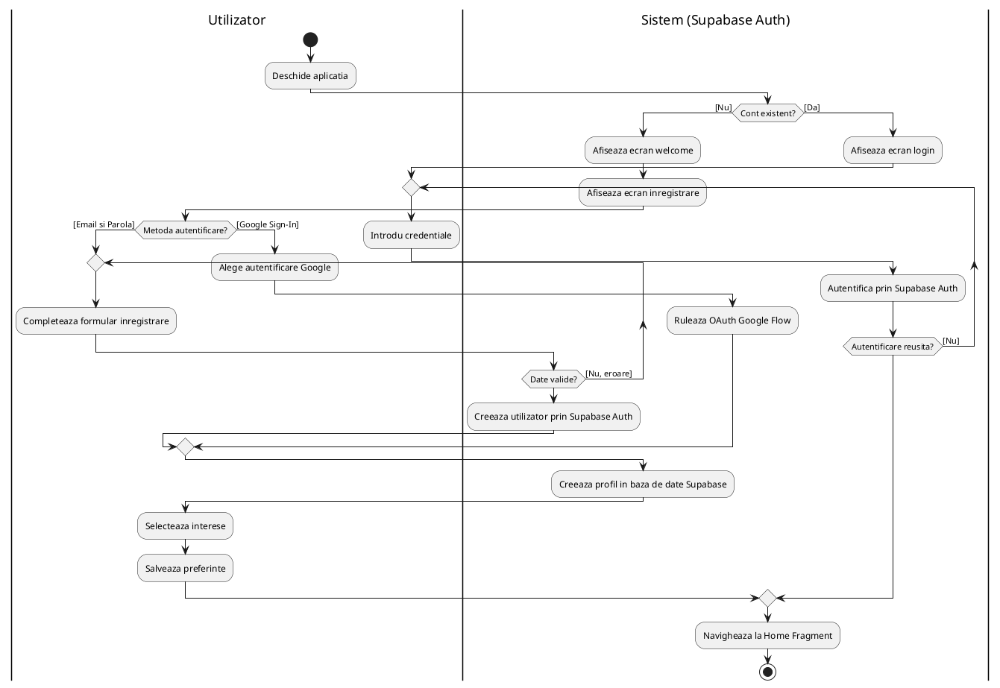
```plantuml
@startuml
skinparam swimlaneWidth 150

|Utilizator|
start
:Deschide aplicatia;

|Sistem (Supabase Auth)|
if (Cont existent?) then ([Nu])
  :Afiseaza ecran welcome;
  :Afiseaza ecran inregistrare;
  
  |Utilizator|
  if (Metoda autentificare?) then ([Email si Parola])
    repeat
      :Completeaza formular inregistrare;
      |Sistem (Supabase Auth)|
    repeat while (Date valide?) is ([Nu, eroare])
    :Creeaza utilizator prin Supabase Auth;
  else ([Google Sign-In])
    |Utilizator|
    :Alege autentificare Google;
    |Sistem (Supabase Auth)|
    :Ruleaza OAuth Google Flow;
  endif
  :Creeaza profil in baza de date Supabase;
  
  |Utilizator|
  :Selecteaza interese;
  :Salveaza preferinte;
else ([Da])
  |Sistem (Supabase Auth)|
  :Afiseaza ecran login;
  
  |Utilizator|
  repeat
    :Introdu credentiale;
    |Sistem (Supabase Auth)|
    :Autentifica prin Supabase Auth;
  repeat while (Autentificare reusita?) is ([Nu])
endif
:Navigheaza la Home Fragment;
stop
@enduml
```

#### B. Diagrama de Activitate - Explorare și Planificare Locații
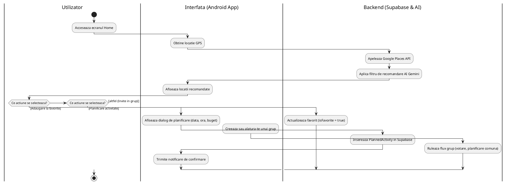
```plantuml
@startuml
|Utilizator|
start
:Acceseaza ecranul Home;
|Interfata (Android App)|
:Obtine locatie GPS;
|Backend (Supabase & AI)|
:Apeleaza Google Places API;
:Aplica filtru de recomandare AI Gemini;
|Interfata (Android App)|
:Afiseaza locatii recomandate;
|Utilizator|
if (Ce actiune se selecteaza?) then ([Adaugare la favorite])
  |Backend (Supabase & AI)|
  :Actualizeaza favorit (isFavorite = true);
elseif (Ce actiune se selecteaza?) then ([Planificare activitate])
  |Interfata (Android App)|
  :Afiseaza dialog de planificare (data, ora, buget);
  |Backend (Supabase & AI)|
  :Insereaza PlannedActivity in Supabase;
  |Interfata (Android App)|
  :Trimite notificare de confirmare;
else ([altfel (Invite in grup)])
  |Interfata (Android App)|
  :Creeaza sau alatura-te unui grup;
  |Backend (Supabase & AI)|
  :Ruleaza flux grup (votare, planificare comuna);
endif
|Utilizator|
stop
@enduml
```

#### C. Diagrama de Activitate - Gamificare si Feed Social
*Descrie interactiunea dintre Utilizator, Aplicatie si Motorul de XP la finalizarea unei activitati si publicarea in feed.*

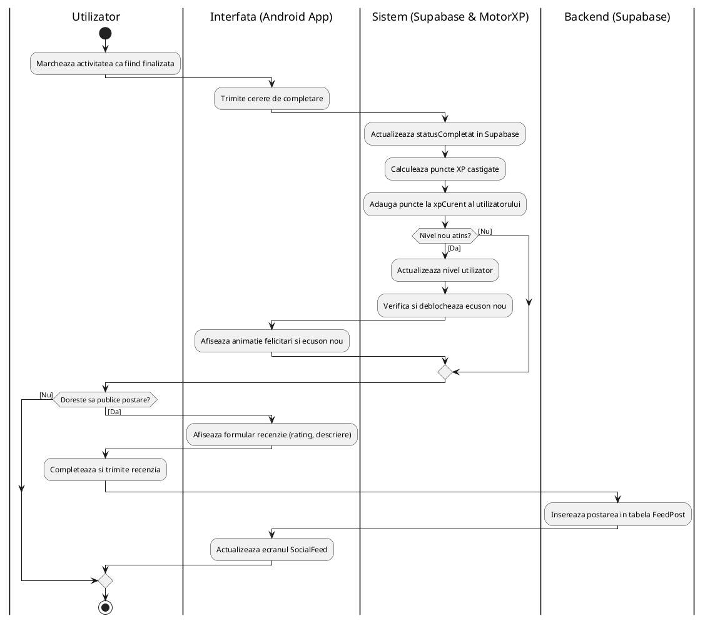
```plantuml
@startuml
|Utilizator|
start
:Marcheaza activitatea ca fiind finalizata;
|Interfata (Android App)|
:Trimite cerere de completare;
|Sistem (Supabase & MotorXP)|
:Actualizeaza statusCompletat in Supabase;
:Calculeaza puncte XP castigate;
:Adauga puncte la xpCurent al utilizatorului;
if (Nivel nou atins?) then ([Da])
  :Actualizeaza nivel utilizator;
  :Verifica si deblocheaza ecuson nou;
  |Interfata (Android App)|
  :Afiseaza animatie felicitari si ecuson nou;
else ([Nu])
endif
|Utilizator|
if (Doreste sa publice postare?) then ([Da])
  |Interfata (Android App)|
  :Afiseaza formular recenzie (rating, descriere);
  |Utilizator|
  :Completeaza si trimite recenzia;
  |Backend (Supabase)|
  :Insereaza postarea in tabela FeedPost;
  |Interfata (Android App)|
  :Actualizeaza ecranul SocialFeed;
else ([Nu])
endif
|Utilizator|
stop
@enduml
```

#### D. Diagrama de Activitate - Generare Itinerar AI
*Descrie fluxul prin care utilizatorul solicita un itinerar personalizat de o zi, iar backend-ul apeleaza Gemini API pentru a-l construi.*

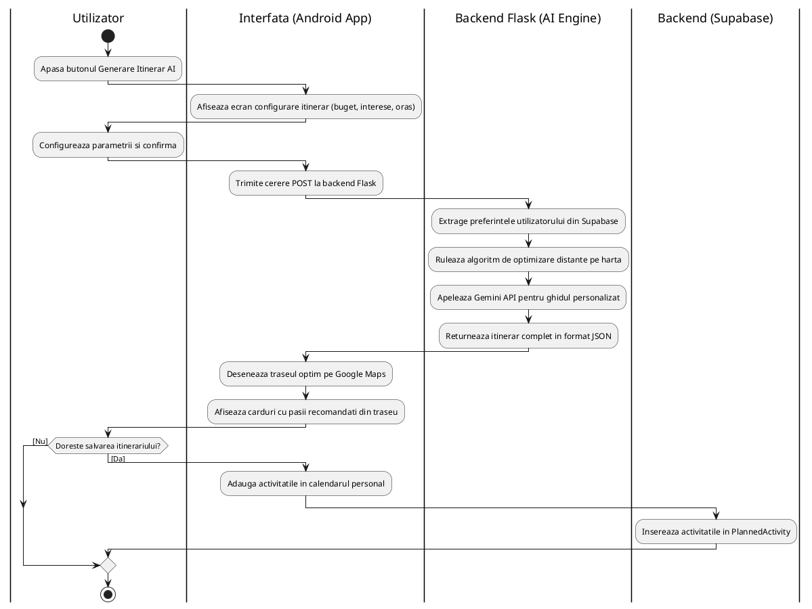
```plantuml
@startuml
|Utilizator|
start
:Apasa butonul Generare Itinerar AI;
|Interfata (Android App)|
:Afiseaza ecran configurare itinerar (buget, interese, oras);
|Utilizator|
:Configureaza parametrii si confirma;
|Interfata (Android App)|
:Trimite cerere POST la backend Flask;
|Backend Flask (AI Engine)|
:Extrage preferintele utilizatorului din Supabase;
:Ruleaza algoritm de optimizare distante pe harta;
:Apeleaza Gemini API pentru ghidul personalizat;
:Returneaza itinerar complet in format JSON;
|Interfata (Android App)|
:Deseneaza traseul optim pe Google Maps;
:Afiseaza carduri cu pasii recomandati din traseu;
|Utilizator|
if (Doreste salvarea itinerariului?) then ([Da])
  |Interfata (Android App)|
  :Adauga activitatile in calendarul personal;
  |Backend (Supabase)|
  :Insereaza activitatile in PlannedActivity;
else ([Nu])
endif
|Utilizator|
stop
@enduml
```

---

### 2.4 Diagramele de Stare (Ciclul de Viață al Entităților)
* **Reguli respectate din Seminarul 6 (Diagrama de mașină de stări):**
  * Stările sunt denumite descriptiv folosind **adjective** la genul corespunzător entității (feminin singular pentru *Activitate*, masculin singular pentru *Itinerar* și *Ecuson*).
  * Toate tranzițiile au asociate evenimente și respectă formatul strict: `declanșator [condiție] / efect` sau `declanșator / efect`.
  * Pentru compatibilitate maximă cu Visual Paradigm Desktop și site-urile de randare PlantUML (evitând complet erorile de encoding/locale sau ecranele albe), codurile PlantUML folosesc denumiri de stări și evenimente **fără diacritice**, dar sunt însoțite de explicații academice detaliate în text.

#### A. Ciclul de Viață al unei Activități Planificate
* **Entitate vizată:** `ActivitatePlanificata` (genul feminin).
* **Stări (adjective):** `Creata`, `Planificata`, `InDesfasurare`, `Finalizata`, `Anulata`.

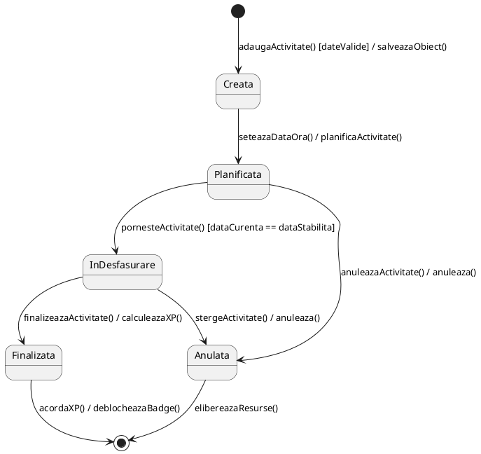
```plantuml
@startuml
skinparam stateAttributeIconSize 0

[*] --> Creata : adaugaActivitate() [dateValide] / salveazaObiect()
Creata --> Planificata : seteazaDataOra() / planificaActivitate()
Planificata --> InDesfasurare : pornesteActivitate() [dataCurenta == dataStabilita]

InDesfasurare --> Finalizata : finalizeazaActivitate() / calculeazaXP()
InDesfasurare --> Anulata : stergeActivitate() / anuleaza()
Planificata --> Anulata : anuleazaActivitate() / anuleaza()

Finalizata --> [*] : acordaXP() / deblocheazaBadge()
Anulata --> [*] : elibereazaResurse()
@enduml
```

#### B. Ciclul de Viață al unui Itinerar (Generat prin AI)
* **Entitate vizată:** `Itinerariu` (genul masculin/neutru).
* **Stări (adjective):** `Generat` (temporar prin Gemini API), `Salvat` (confirmat în calendar), `Activ` (în curs de desfășurare pe parcursul zilei), `Completat` (toate punctele de oprire vizitate), `Abandonat` (anulat de utilizator).

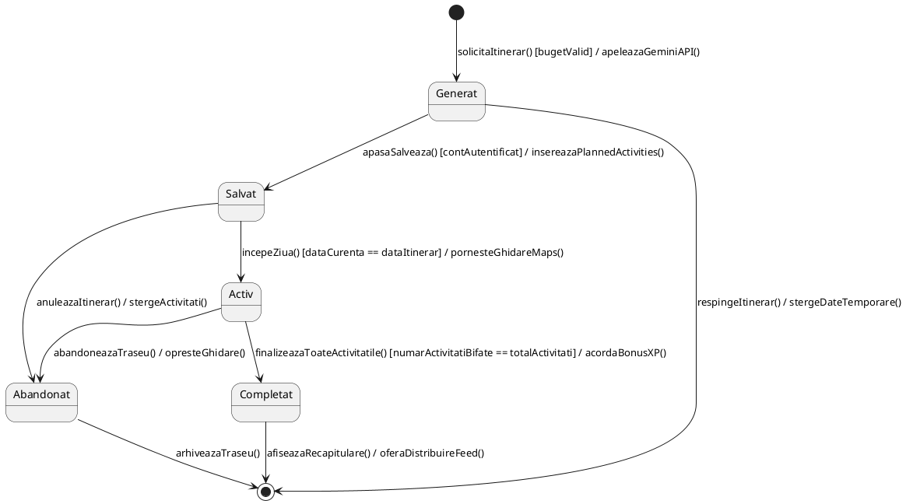
```plantuml
@startuml
skinparam stateAttributeIconSize 0

[*] --> Generat : solicitaItinerar() [bugetValid] / apeleazaGeminiAPI()
Generat --> Salvat : apasaSalveaza() [contAutentificat] / insereazaPlannedActivities()
Generat --> [*] : respingeItinerar() / stergeDateTemporare()

Salvat --> Activ : incepeZiua() [dataCurenta == dataItinerar] / pornesteGhidareMaps()
Salvat --> Abandonat : anuleazaItinerar() / stergeActivitati()

Activ --> Completat : finalizeazaToateActivitatile() [numarActivitatiBifate == totalActivitati] / acordaBonusXP()
Activ --> Abandonat : abandoneazaTraseu() / opresteGhidare()

Completat --> [*] : afiseazaRecapitulare() / oferaDistribuireFeed()
Abandonat --> [*] : arhiveazaTraseu()
@enduml
```

#### C. Ciclul de Viață al unui Ecuson (Sistemul de Gamificare)
* **Entitate vizată:** `Ecuson` (genul masculin).
* **Stări (adjective):** `Blocat` (inițializat, dar neeligibil), `Eligibil` (aproape de deblocare, prag atins -100 XP), `Deblocat` (deblocat prin atingerea pragului sau misiunii), `Echipat` (afișat pe profilul public al utilizatorului).

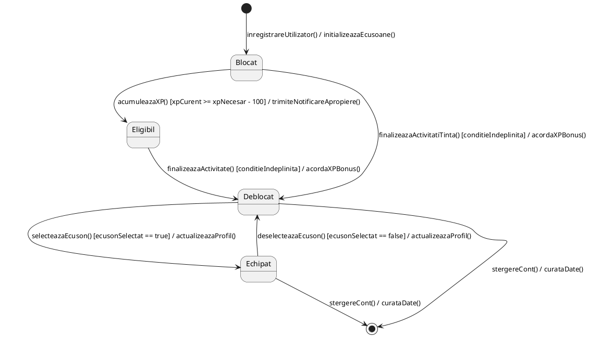
```plantuml
@startuml
skinparam stateAttributeIconSize 0

[*] --> Blocat : inregistrareUtilizator() / initializeazaEcusoane()
Blocat --> Eligibil : acumuleazaXP() [xpCurent >= xpNecesar - 100] / trimiteNotificareApropiere()
Blocat --> Deblocat : finalizeazaActivitatiTinta() [conditieIndeplinita] / acordaXPBonus()

Eligibil --> Deblocat : finalizeazaActivitate() [conditieIndeplinita] / acordaXPBonus()
Deblocat --> Echipat : selecteazaEcuson() [ecusonSelectat == true] / actualizeazaProfil()
Echipat --> Deblocat : deselecteazaEcuson() [ecusonSelectat == false] / actualizeazaProfil()

Deblocat --> [*] : stergereCont() / curataDate()
Echipat --> [*] : stergereCont() / curataDate()
@enduml
```

#### D. Ciclul de Viață al unui Grup de Activitate (ActivityGroup)
* **Entitate vizată:** `GrupActivitate` (genul masculin).
* **Stări (adjective):** `Creat` (grupul este instanțiat), `Deschis` (codul este generat și membrii se pot alătura), `InVotare` (sondajul/votarea este activă, cu tranziție reflexivă pentru adăugarea repetată a voturilor), `Planificat` (votarea s-a încheiat și locația câștigătoare a fost stabilită), `Inchis` (activitatea s-a încheiat, grupul este arhivat).

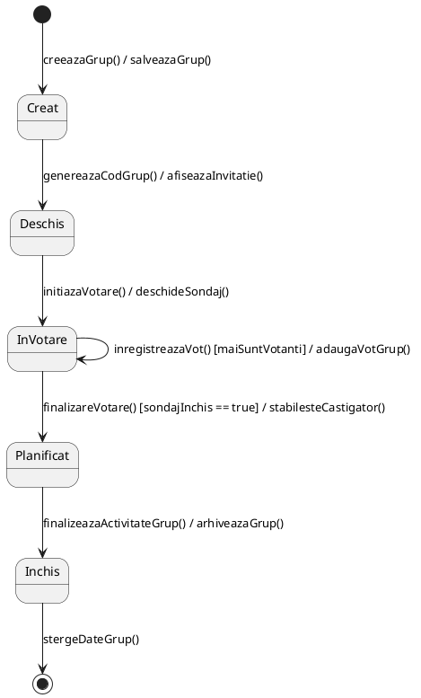
```plantuml
@startuml
skinparam stateAttributeIconSize 0

[*] --> Creat : creeazaGrup() / salveazaGrup()
Creat --> Deschis : genereazaCodGrup() / afiseazaInvitatie()
Deschis --> InVotare : initiazaVotare() / deschideSondaj()

InVotare --> InVotare : inregistreazaVot() [maiSuntVotanti] / adaugaVotGrup()
InVotare --> Planificat : finalizareVotare() [sondajInchis == true] / stabilesteCastigator()

Planificat --> Inchis : finalizeazaActivitateGrup() / arhiveazaGrup()
Inchis --> [*] : stergeDateGrup()
@enduml
```

#### E. Ciclul de Viață al Utilizatorului (Sesiune și Autentificare)
* **Entitate vizată:** `Utilizator` (genul masculin).
* **Stări:** `Neautentificat` (afișează ecranul Welcome), `Autentificat` (stare compusă cu sub-stările `Activ` și `Inactiv`).
* **Acțiuni interne:** folosesc `do /` pentru activități continue și `entry /` pentru acțiuni de intrare, conform formatului din Seminarul 6.
* **Starea compusă `Autentificat`** conține un automat imbricat care gestionează sesiunea activă a utilizatorului (tranziție la `Inactiv` după timeout și revenire prin interacțiune).

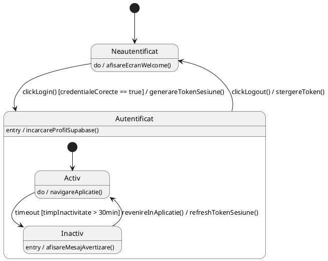
```plantuml
@startuml
skinparam stateAttributeIconSize 0

state Neautentificat {
  Neautentificat : do / afisareEcranWelcome()
}

state Autentificat {
  Autentificat : entry / incarcareProfilSupabase()

  state Activ {
    Activ : do / navigareAplicatie()
  }

  state Inactiv {
    Inactiv : entry / afisareMesajAvertizare()
  }

  [*] --> Activ
  Activ --> Inactiv : timeout [timpInactivitate > 30min]
  Inactiv --> Activ : revenireInAplicatie() / refreshTokenSesiune()
}

[*] --> Neautentificat
Neautentificat --> Autentificat : clickLogin() [credentialeCorecte == true] / generareTokenSesiune()
Autentificat --> Neautentificat : clickLogout() / stergereToken()
@enduml
```

#### F. Progresul Utilizatorului (Niveluri Gamificare)
* **Entitate vizată:** `Utilizator` (genul masculin).
* **Stări (adjective):** `Incepator` (nivel 1, <500 XP), `Explorator` (nivel 2, >=500 XP), `Aventurier` (nivel 3, >=1000 XP), `Expert` (nivel 4, >=2000 XP), `Legendar` (nivel 5+, >=5000 XP).
* **Tranziții reflexive:** Permisibile pe fiecare stare pentru adăugarea de XP la completarea activităților fără a depăși pragul nivelului curent.

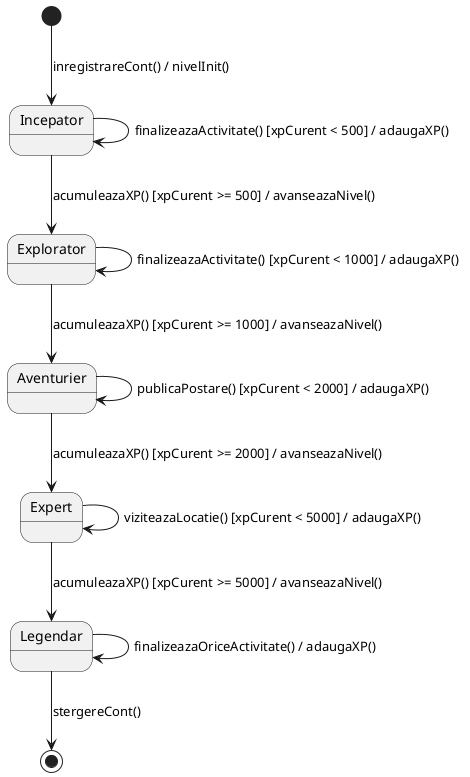
```plantuml
@startuml
skinparam stateAttributeIconSize 0

[*] --> Incepator : inregistrareCont() / nivelInit()

Incepator --> Incepator : finalizeazaActivitate() [xpCurent < 500] / adaugaXP()
Incepator --> Explorator : acumuleazaXP() [xpCurent >= 500] / avanseazaNivel()

Explorator --> Explorator : finalizeazaActivitate() [xpCurent < 1000] / adaugaXP()
Explorator --> Aventurier : acumuleazaXP() [xpCurent >= 1000] / avanseazaNivel()

Aventurier --> Aventurier : publicaPostare() [xpCurent < 2000] / adaugaXP()
Aventurier --> Expert : acumuleazaXP() [xpCurent >= 2000] / avanseazaNivel()

Expert --> Expert : viziteazaLocatie() [xpCurent < 5000] / adaugaXP()
Expert --> Legendar : acumuleazaXP() [xpCurent >= 5000] / avanseazaNivel()

Legendar --> Legendar : finalizeazaOriceActivitate() / adaugaXP()
Legendar --> [*] : stergereCont()
@enduml
```

---

### 2.5 Diagramele de Secvență (Interacțiunea dintre Obiecte)

#### A. Diagrama de Secvență - Home Fragment (Obținere Locații)
* **Reguli respectate din Seminarul 7:**
  * Reprezentarea lifeline-urilor sub formatul `numeObiect: Clasa` cu stereotipurile corespunzătoare: `<<actor>>`, `<<boundary>>`, `<<control>>`.
  * Transmiterea mesajelor prin apeluri sincrone (săgeți pline) și mesaje de return (săgeți întrerupte `-->`).
  * Denumirile mesajelor folosesc **verbe camelCase** ce reprezintă metode reale.

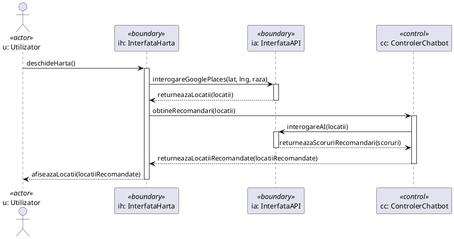
```plantuml
@startuml
actor "u: Utilizator" as U <<actor>>
participant "ih: InterfataHarta" as IH <<boundary>>
participant "ia: InterfataAPI" as IA <<boundary>>
participant "cc: ControlerChatbot" as CC <<control>>

U -> IH: deschideHarta()
activate IH
IH -> IA: interogareGooglePlaces(lat, lng, raza)
activate IA
IA --> IH: returneazaLocatii(locatii)
deactivate IA

IH -> CC: obtineRecomandari(locatii)
activate CC
CC -> IA: interogareAI(locatii)
activate IA
IA --> CC: returneazaScoruriRecomandari(scoruri)
deactivate IA
CC --> IH: returneazaLocatiiRecomandate(locatiiRecomandate)
deactivate CC

IH --> U: afiseazaLocatii(locatiiRecomandate)
deactivate IH
@enduml
```

#### B. Diagrama de Secvență - Grupuri și Votare
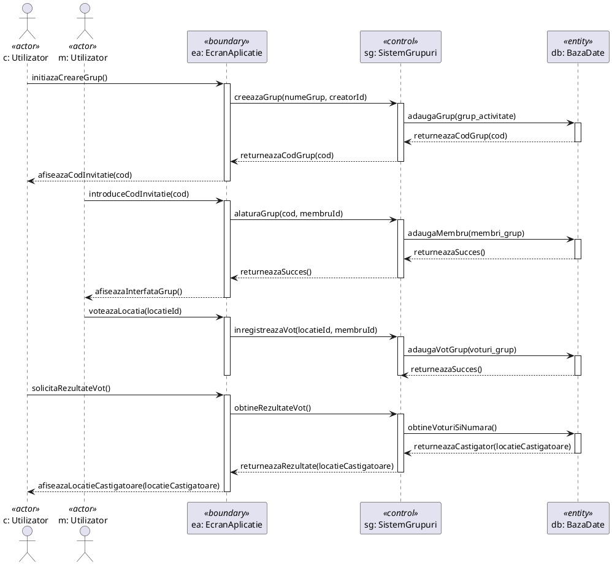
```plantuml
@startuml
actor "c: Utilizator" as C <<actor>>
actor "m: Utilizator" as M <<actor>>
participant "ea: EcranAplicatie" as EA <<boundary>>
participant "sg: SistemGrupuri" as SG <<control>>
participant "db: BazaDate" as DB <<entity>>

C -> EA: initiazaCreareGrup()
activate EA
EA -> SG: creeazaGrup(numeGrup, creatorId)
activate SG
SG -> DB: adaugaGrup(grup_activitate)
activate DB
DB --> SG: returneazaCodGrup(cod)
deactivate DB
SG --> EA: returneazaCodGrup(cod)
deactivate SG
EA --> C: afiseazaCodInvitatie(cod)
deactivate EA

M -> EA: introduceCodInvitatie(cod)
activate EA
EA -> SG: alaturaGrup(cod, membruId)
activate SG
SG -> DB: adaugaMembru(membri_grup)
activate DB
DB --> SG: returneazaSucces()
deactivate DB
SG --> EA: returneazaSucces()
deactivate SG
EA --> M: afiseazaInterfataGrup()
deactivate EA

M -> EA: voteazaLocatia(locatieId)
activate EA
EA -> SG: inregistreazaVot(locatieId, membruId)
activate SG
SG -> DB: adaugaVotGrup(voturi_grup)
activate DB
DB --> SG: returneazaSucces()
deactivate DB
deactivate SG
deactivate EA

C -> EA: solicitaRezultateVot()
activate EA
EA -> SG: obtineRezultateVot()
activate SG
SG -> DB: obtineVoturiSiNumara()
activate DB
DB --> SG: returneazaCastigator(locatieCastigatoare)
deactivate DB
SG --> EA: returneazaRezultate(locatieCastigatoare)
deactivate SG
EA --> C: afiseazaLocatieCastigatoare(locatieCastigatoare)
deactivate EA
@enduml
```

---

## CAPITOLUL 3: PROIECTAREA SISTEMULUI (DIAGRAME DETALIATE)

### 3.2 Diagrama de Clase Variantă Completă (Proiectarea Detaliată a Claselor)
* **Reguli respectate din Seminarul 4:**
  * Formatul standardizat al atributelor: `[vizibilitate] nume: tip`.
  * Formatul standardizat al operațiilor: `[vizibilitate] nume([directie] parametru: tip): tipReturnat {proprietate}`.
  * Evidențierea metodelor de tip interogare prin `{query}`.

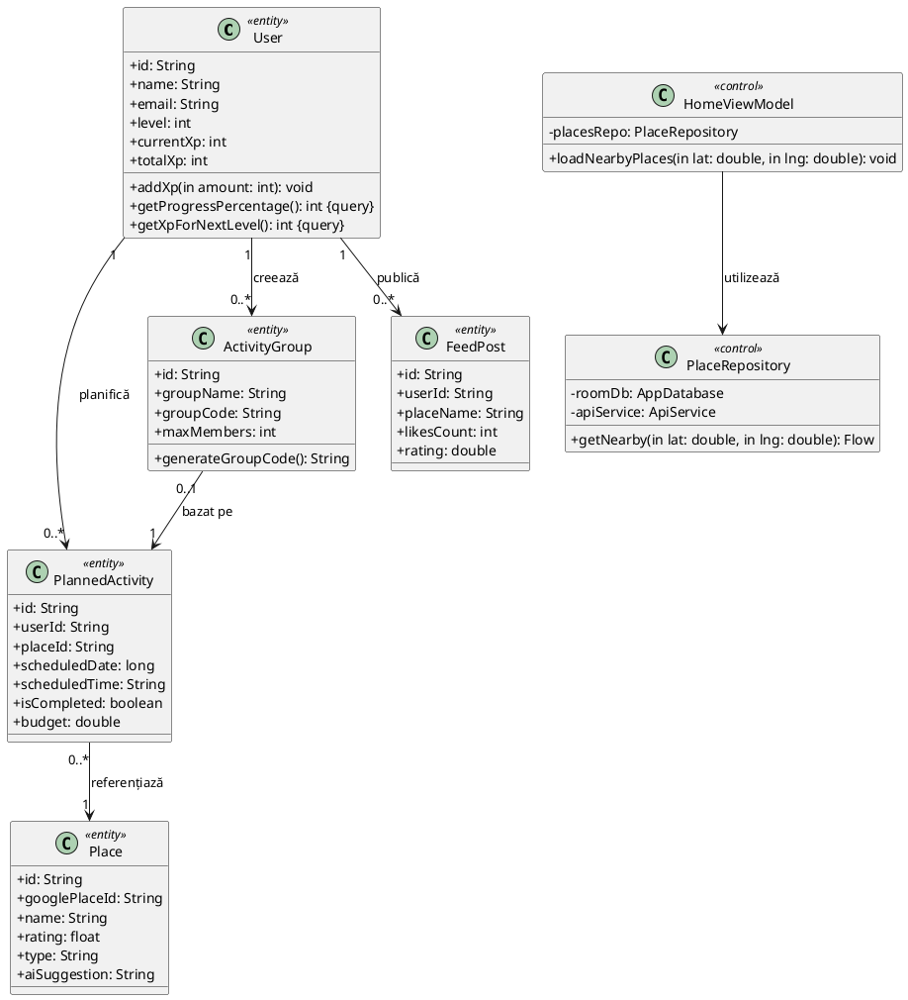
```plantuml
@startuml
skinparam classAttributeIconSize 0

class User <<entity>> {
  + id: String
  + name: String
  + email: String
  + level: int
  + currentXp: int
  + totalXp: int
  + addXp(in amount: int): void
  + getProgressPercentage(): int {query}
  + getXpForNextLevel(): int {query}
}

class Place <<entity>> {
  + id: String
  + googlePlaceId: String
  + name: String
  + rating: float
  + type: String
  + aiSuggestion: String
}

class PlannedActivity <<entity>> {
  + id: String
  + userId: String
  + placeId: String
  + scheduledDate: long
  + scheduledTime: String
  + isCompleted: boolean
  + budget: double
}

class ActivityGroup <<entity>> {
  + id: String
  + groupName: String
  + groupCode: String
  + maxMembers: int
  + generateGroupCode(): String
}

class FeedPost <<entity>> {
  + id: String
  + userId: String
  + placeName: String
  + likesCount: int
  + rating: double
}

class HomeViewModel <<control>> {
  - placesRepo: PlaceRepository
  + loadNearbyPlaces(in lat: double, in lng: double): void
}

class PlaceRepository <<control>> {
  - roomDb: AppDatabase
  - apiService: ApiService
  + getNearby(in lat: double, in lng: double): Flow
}

User "1" --> "0..*" PlannedActivity : planifică
User "1" --> "0..*" ActivityGroup : creează
ActivityGroup "0..1" --> "1" PlannedActivity : bazat pe
PlannedActivity "0..*" --> "1" Place : referențiază
User "1" --> "0..*" FeedPost : publică

HomeViewModel --> PlaceRepository : utilizează
@enduml
```

---

### 3.3 Modelul Bazei de Date (ERD - Entitate Relație)
* Reprezentarea tabelelor fizice din Supabase (PostgreSQL), cu tipuri de date, chei primare (`PK`) și chei externe (`FK`).

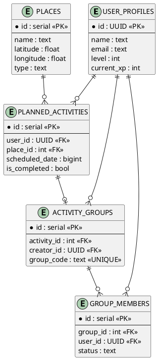
```plantuml
@startuml
entity "USER_PROFILES" as U {
  * id : UUID <<PK>>
  --
  name : text
  email : text
  level : int
  current_xp : int
}

entity "PLACES" as P {
  * id : serial <<PK>>
  --
  name : text
  latitude : float
  longitude : float
  type : text
}

entity "PLANNED_ACTIVITIES" as PA {
  * id : serial <<PK>>
  --
  user_id : UUID <<FK>>
  place_id : int <<FK>>
  scheduled_date : bigint
  is_completed : bool
}

entity "ACTIVITY_GROUPS" as AG {
  * id : serial <<PK>>
  --
  activity_id : int <<FK>>
  creator_id : UUID <<FK>>
  group_code : text <<UNIQUE>>
}

entity "GROUP_MEMBERS" as GM {
  * id : serial <<PK>>
  --
  group_id : int <<FK>>
  user_id : UUID <<FK>>
  status : text
}

U ||--o{ PA
U ||--o{ AG
P ||--o{ PA
PA ||--o| AG
AG ||--o{ GM
U ||--o{ GM
@enduml
```

---

### 3.4 Fereastra de Navigare (Ierarhia Ferestrelor Aplicației - Capitolul 3.4)
* Reprezintă fluxul de ecrane (UI Navigation Flow) din aplicația Android modelat prin diagrame de stări UML, util pentru capitolul de interfețe.

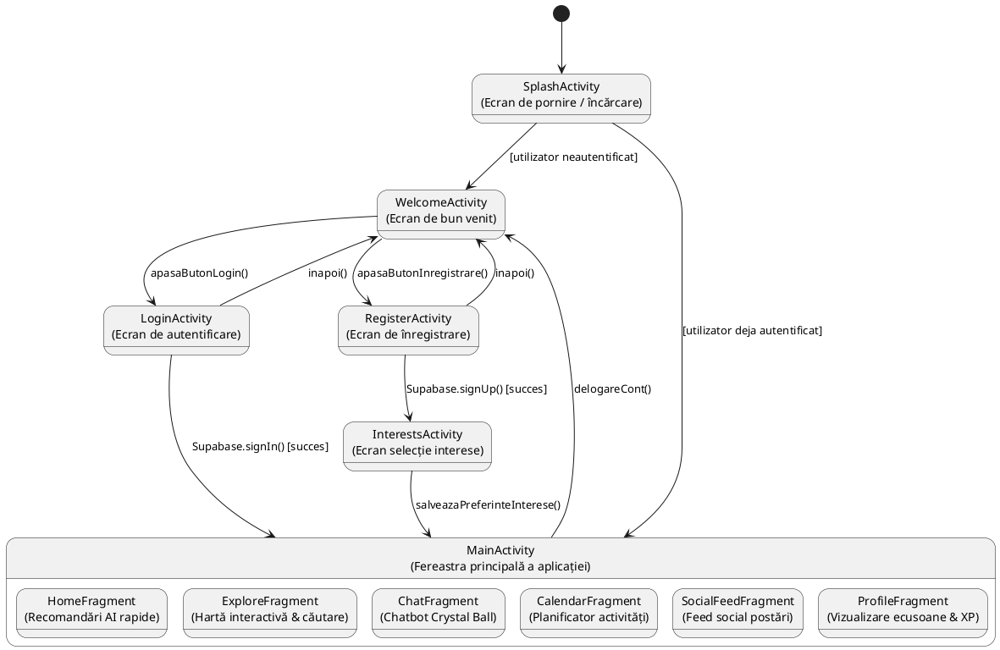
```plantuml
@startuml
skinparam stateAttributeIconSize 0

state "SplashActivity\n(Ecran de pornire / încărcare)" as Splash
state "WelcomeActivity\n(Ecran de bun venit)" as Welcome
state "LoginActivity\n(Ecran de autentificare)" as Login
state "RegisterActivity\n(Ecran de înregistrare)" as Register
state "InterestsActivity\n(Ecran selecție interese)" as Interests
state "MainActivity\n(Fereastra principală a aplicației)" as Main {
  state "HomeFragment\n(Recomandări AI rapide)" as HomeTab
  state "ExploreFragment\n(Hartă interactivă & căutare)" as ExploreTab
  state "ChatFragment\n(Chatbot Crystal Ball)" as ChatTab
  state "CalendarFragment\n(Planificator activități)" as CalendarTab
  state "SocialFeedFragment\n(Feed social postări)" as FeedTab
  state "ProfileFragment\n(Vizualizare ecusoane & XP)" as ProfileTab
}

[*] --> Splash
Splash --> Main : [utilizator deja autentificat]
Splash --> Welcome : [utilizator neautentificat]

Welcome --> Login : apasaButonLogin()
Welcome --> Register : apasaButonInregistrare()

Login --> Main : Supabase.signIn() [succes]
Login --> Welcome : inapoi()

Register --> Interests : Supabase.signUp() [succes]
Register --> Welcome : inapoi()

Interests --> Main : salveazaPreferinteInterese()

Main --> Welcome : delogareCont()
@enduml
```

---

### 3.5 Arhitectura Sistemului (Componente și Desfășurare)

#### A. Diagrama de Componente (Arhitectura Software - Proiectare)
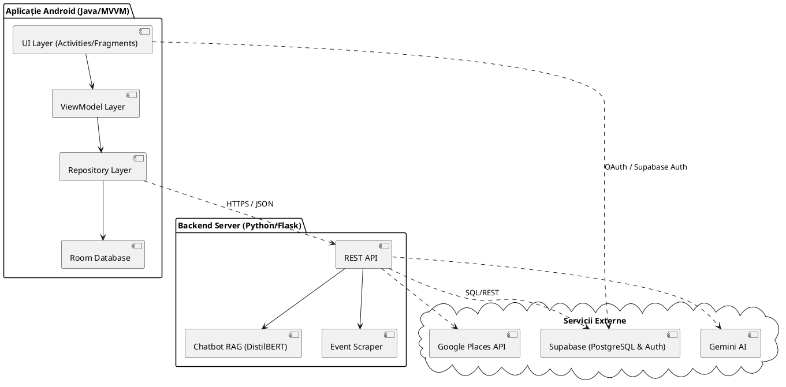
```plantuml
@startuml
package "Aplicație Android (Java/MVVM)" {
  [UI Layer (Activities/Fragments)] as UI
  [ViewModel Layer] as VM
  [Repository Layer] as Repo
  [Room Database] as RoomDB
  
  UI --> VM
  VM --> Repo
  Repo --> RoomDB
}

package "Backend Server (Python/Flask)" {
  [REST API] as API
  [Chatbot RAG (DistilBERT)] as Chatbot
  [Event Scraper] as Scraper
  
  API --> Chatbot
  API --> Scraper
}

cloud "Servicii Externe" {
  [Supabase (PostgreSQL & Auth)] as Supa
  [Google Places API] as Google
  [Gemini AI] as Gemini
}

Repo ..> API : HTTPS / JSON
API ..> Supa : SQL/REST
API ..> Google
API ..> Gemini
UI ..> Supa : OAuth / Supabase Auth
@enduml
```

#### B. Diagrama de Desfășurare (Deployment Diagram - Arhitectura Fizică a Sistemului)
* Această diagramă arată nodurile fizice hardware, componentele software care rulează pe ele și protocoalele de rețea prin care acestea comunică. Foarte importantă pentru capitolul 3.5 din licență.

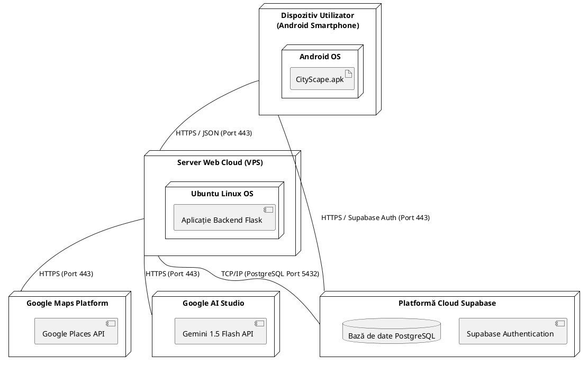
```plantuml
@startuml
skinparam nodeStyle rectangle

node "Dispozitiv Utilizator\n(Android Smartphone)" as ClientNode {
  node "Android OS" {
    artifact "CityScape.apk" as APK
  }
}

node "Server Web Cloud (VPS)" as FlaskNode {
  node "Ubuntu Linux OS" {
    component "Aplicație Backend Flask" as FlaskApp
  }
}

node "Platformă Cloud Supabase" as SupabaseNode {
  component "Supabase Authentication" as SupaAuth
  database "Bază de date PostgreSQL" as PostgresDB
}

node "Google Maps Platform" as GoogleMapsNode {
  component "Google Places API" as GoogleAPI
}

node "Google AI Studio" as GeminiNode {
  component "Gemini 1.5 Flash API" as GeminiAPI
}

' Protocoale de comunicare fizică între noduri
ClientNode -- FlaskNode : HTTPS / JSON (Port 443)
ClientNode -- SupabaseNode : HTTPS / Supabase Auth (Port 443)
FlaskNode -- SupabaseNode : TCP/IP (PostgreSQL Port 5432)
FlaskNode -- GoogleMapsNode : HTTPS (Port 443)
FlaskNode -- GeminiNode : HTTPS (Port 443)
@enduml
```
