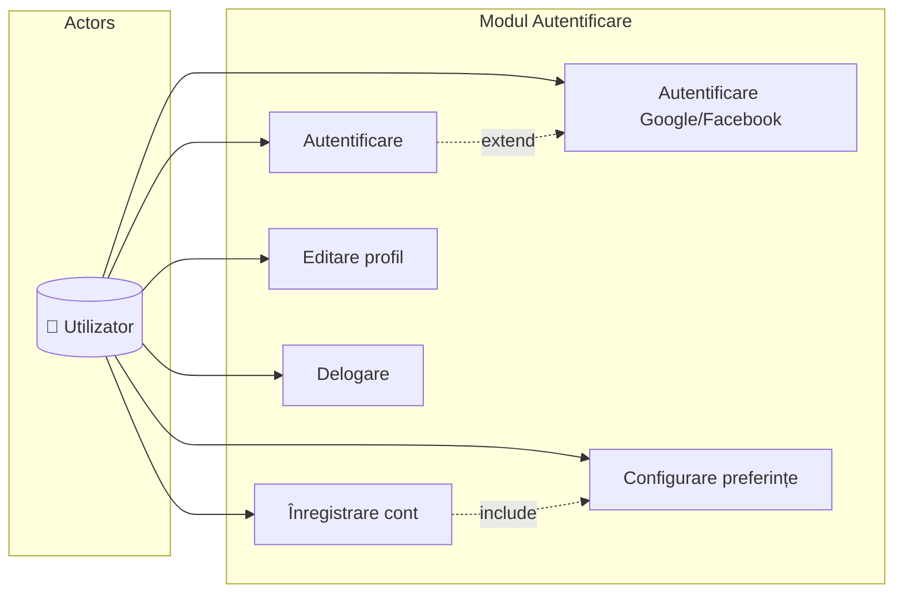
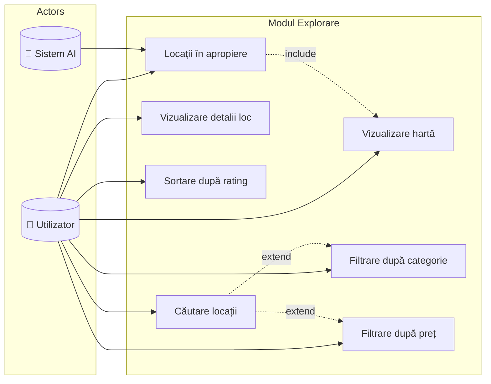
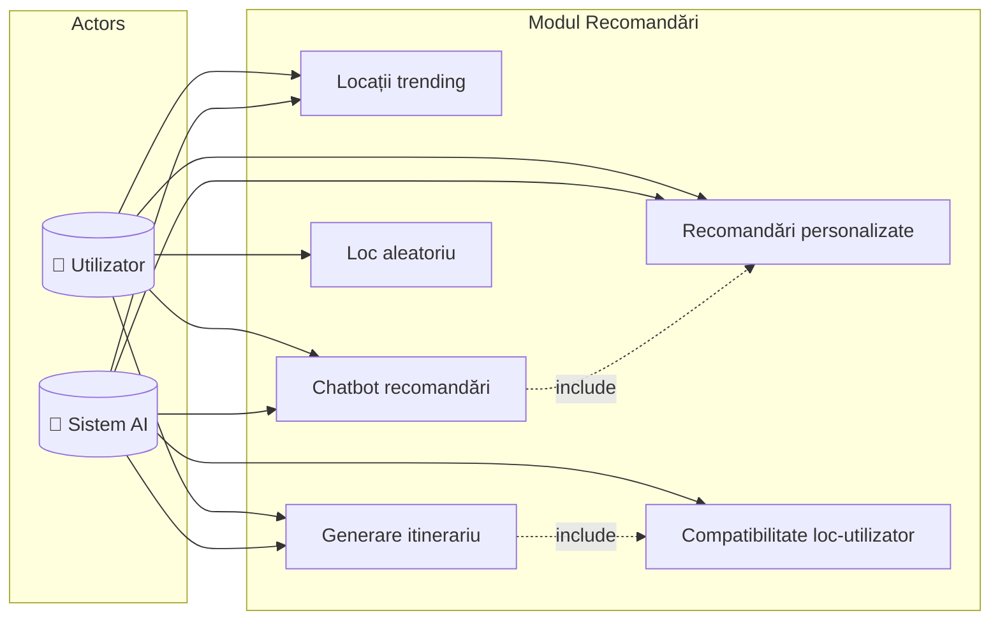
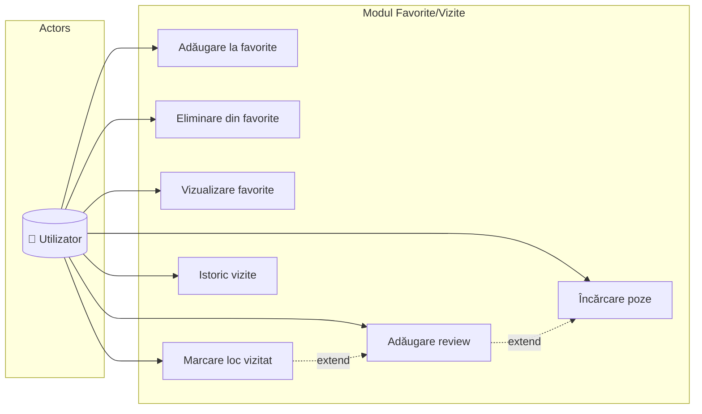
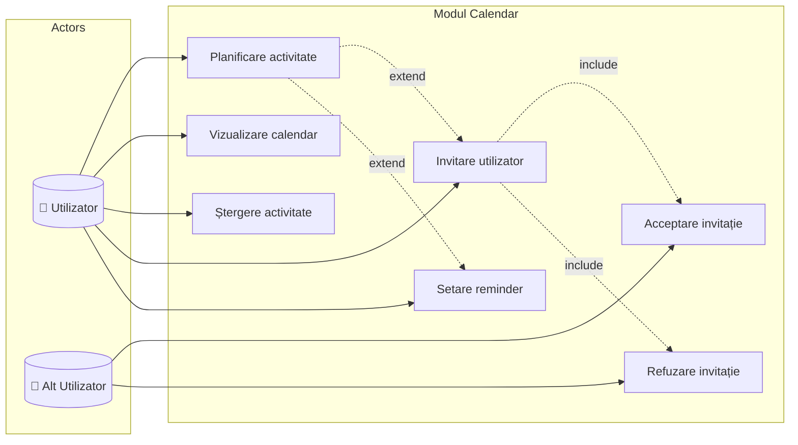
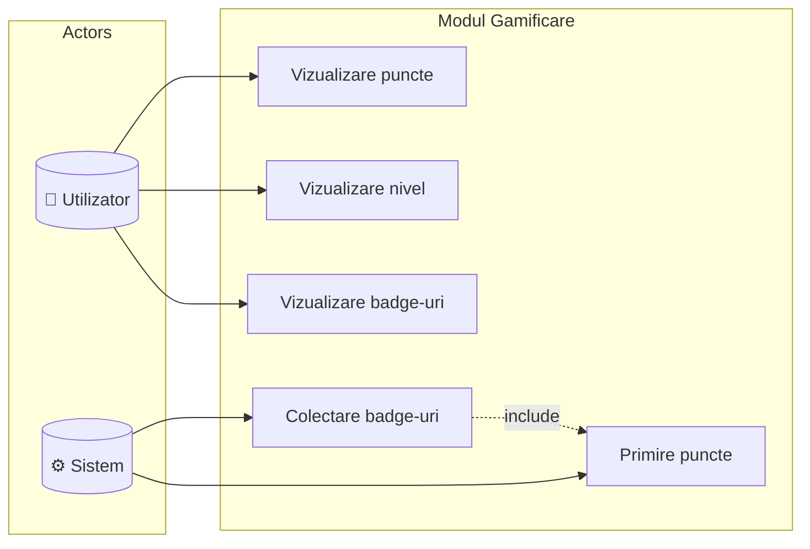
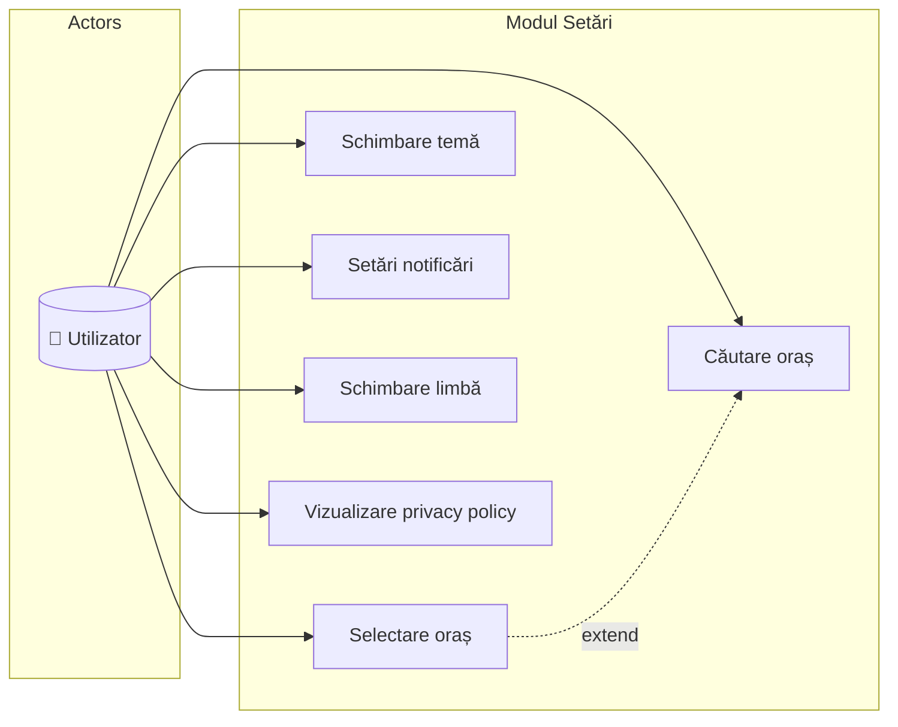

# 1.2.1 Diagrame ale Cazurilor de Utilizare - CityScape

## Actori Principali
- **Utilizator Neautentificat** - vizitator care nu s-a logat
- **Utilizator Autentificat** - utilizator înregistrat și logat
- **Sistem AI** - componenta de inteligență artificială
- **Administrator** - moderator al locațiilor propuse

---

## UC1: Autentificare și Profil

---

## UC2: Explorare și Căutare Locații

---

## UC3: Recomandări AI

---

## UC4: Gestionare Favorite și Vizite

---

## UC5: Calendar și Planificare

---

## UC6: Gamificare

---

## UC7: Selectare Oraș și Setări

---

## Diagramă Generală - Toate Modulele

```mermaid
flowchart TB
    subgraph Actors
        UN[("👤 Utilizator Neautentificat")]
        UA[("👤 Utilizator Autentificat")]
        AI[("🤖 Sistem AI")]
        S[("⚙️ Sistem")]
    end
    
    subgraph "CityScape Application"
        subgraph "Autentificare"
            A1["Login/Register"]
            A2["Social Login"]
        end
        
        subgraph "Explorare"
            E1["Hartă interactivă"]
            E2["Căutare locații"]
            E3["Detalii loc"]
        end
        
        subgraph "AI Features"
            AI1["Recomandări personalizate"]
            AI2["Itinerariu automat"]
            AI3["Chatbot"]
        end
        
        subgraph "Interacțiune"
            I1["Favorite"]
            I2["Reviews"]
            I3["Calendar/Invitații"]
        end
        
        subgraph "Gamificare"
            G1["Puncte & Nivele"]
            G2["Badge-uri"]
        end
    end
    
    UN --> A1
    UN --> A2
    UN --> E1
    UN --> E2
    
    UA --> E1
    UA --> E2
    UA --> E3
    UA --> AI1
    UA --> AI2
    UA --> AI3
    UA --> I1
    UA --> I2
    UA --> I3
    UA --> G1
    UA --> G2
    
    AI --> AI1
    AI --> AI2
    AI --> AI3
    
    S --> G1
    S --> G2
```

---

## Legendă

| Simbol | Semnificație |
|--------|-------------|
| `-->` | Asociere actor-caz de utilizare |
| `-.->|include|` | Relație de includere (obligatorie) |
| `-.->|extend|` | Relație de extindere (opțională) |
| `👤` | Actor uman |
| `🤖` | Actor sistem (AI) |
| `⚙️` | Actor sistem (backend) |

---

## Descrieri Cazuri de Utilizare Principale

### UC-AUTH-01: Autentificare Utilizator
- **Actor principal:** Utilizator neautentificat
- **Precondiție:** Utilizatorul are cont creat
- **Flux principal:** Email + Parolă → Validare → Acces aplicație
- **Flux alternativ:** Login social (Google/Facebook)

### UC-REC-01: Recomandări Personalizate
- **Actor principal:** Utilizator autentificat, Sistem AI
- **Precondiție:** Preferințe utilizator configurate
- **Flux principal:** AI analizează preferințe → Calculare compatibilitate → Afișare top locații

### UC-CAL-01: Planificare Activitate
- **Actor principal:** Utilizator autentificat
- **Precondiție:** Utilizator logat
- **Flux principal:** Selectare loc → Alegere dată/oră → Opțional invitare prieteni → Salvare
