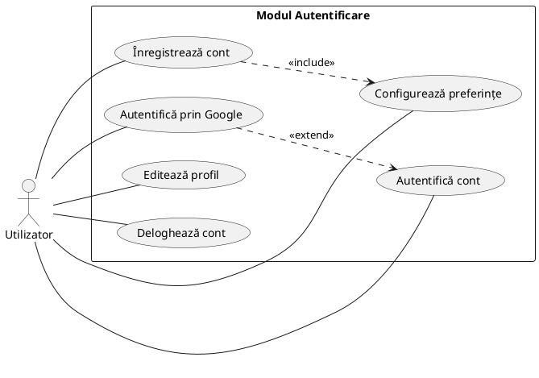
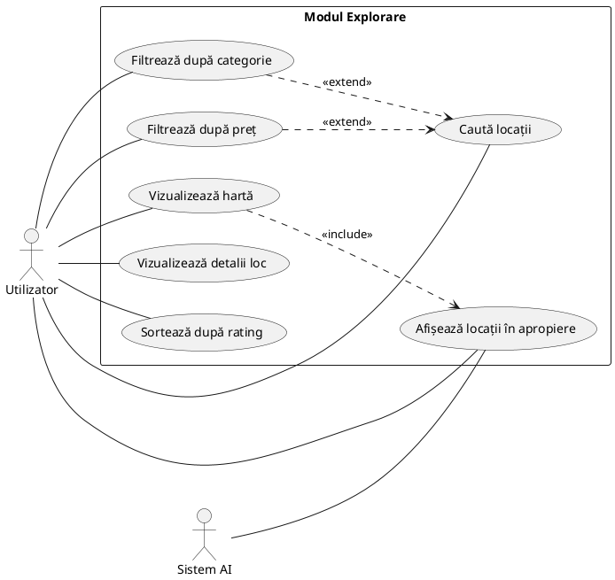
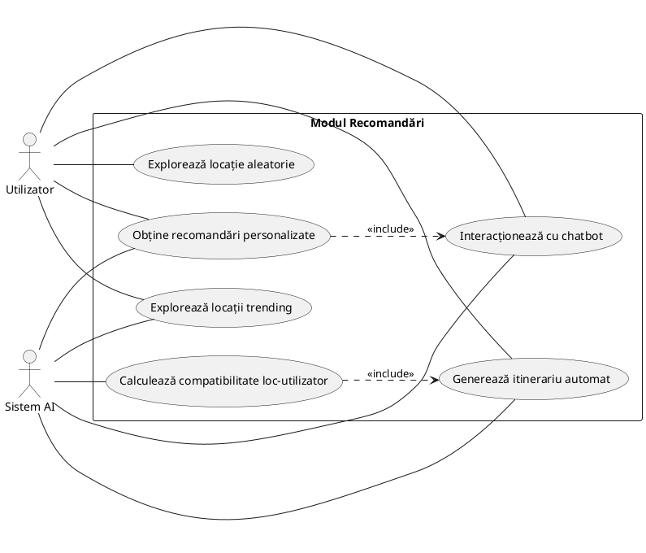

# 1.2.1 Diagrame ale Cazurilor de Utilizare - CityScape (Format PlantUML)

Diagramele cazurilor de utilizare sunt organizate pe module funcționale, revizuite și corectate pentru a respecta cerințele academice stabilite în **seminarul 3 de Proiectarea Sistemelor Informatice (PSI)**:
* Toate numele cazurilor de utilizare încep **obligatoriu cu un VERB** ce definește acțiunea.
* Liniile de legătură dintre actori și cazurile de utilizare sunt simple asocieri (linii simple, fără săgeți, realizate prin sintaxa `--` în PlantUML).
* Relațiile `include` și `extend` sunt clar definite și orientate corect prin săgeți întrerupte.
* Toate diagramele folosesc sintaxa **PlantUML**, complet compatibilă cu Visual Paradigm Desktop și PlantText pentru a evita ecranele albe sau erorile de randare!

---

## SECȚIUNEA 1: DIAGRAMELE VIZUALE ALE CAZURILOR DE UTILIZARE (PLANTUML)

### UC-DET-1: Modulul Autentificare și Configurare Preferințe

---

### UC-DET-2: Modulul Explorare Urbană și Planificare Calendar

---

### UC-DET-3: Modulul Recomandări Inteligente (AI)

---

## SECȚIUNEA 2: DESCRIERILE TEXTUALE ALE CAZURILOR DE UTILIZARE PRINCIPALE
*Conform șablonului formal de modelare din **Seminarul 3 (Slide 28)**, descrierile sunt complete, detaliate și structurate pe toți parametrii necesari evaluării academice.*

### 1. CU01: Înregistrează și Autentifică cont

| Element al cazului de utilizare | Descriere |
| :--- | :--- |
| **Cod** | CU01 |
| **Stare** | Finalizat |
| **Scop** | Permite accesul securizat al utilizatorului la datele sale din CityScape |
| **Nume** | Înregistrează / Autentifică cont |
| **Actor principal** | Utilizator Neautentificat |
| **Descriere** | Utilizatorul își creează un cont sau se autentifică folosind e-mailul/parola sau contul Google pentru a accesa secțiunile personalizate. |
| **Precondiții** | Aplicația este deschisă și conexiunea la internet este activă. |
| **Postcondiții** | Utilizatorul este logat, profilul său este sincronizat din Supabase și are acces la ecranul principal. |
| **Declanșator** | Utilizatorul accesează aplicația și nu este logat. |
| **Flux de bază** | 1. Utilizatorul alege metoda de logare (Email/Parolă sau Google Auth).   2. Utilizatorul introduce credențialele necesare.   3. Aplicația validează local formatul datelor.   4. Sistemul trimite cererea către Supabase Authentication.   5. Supabase confirmă autenticitatea și returnează un token unic de sesiune.   6. Aplicația încarcă datele de profil ale utilizatorului din tabela USER_PROFILES.   7. Se încarcă preferințele utilizatorului și se deschide ecranul `MainActivity`. |
| **Fluxuri alternative** | **A: Utilizatorul este nou (Înregistrare):**   A1. Utilizatorul alege "Înregistrează cont".   A2. Completează datele (Nume, E-mail, Parolă).   A3. Supabase Auth creează utilizatorul, iar profilul este salvat în tabela USER_PROFILES cu Nivelul 1 și 0 XP.   A4. Se deschide ecranul `InterestsActivity` pentru definirea preferințelor, apoi se navighează la MainActivity.   **B: Credențiale invalide:**   B1. Supabase Auth returnează eroare de autentificare.   B2. Aplicația afișează mesaj de eroare și repornește fluxul de introducere date. |
| **Relații** | *Include:* UC4 (Configurează preferințe) în cazul înregistrării.   *Extend:* UC3 (Autentifică prin Google). |
| **Frecvența utilizării** | Zilnic (la fiecare deschidere de sesiune). |
| **Reguli ale afacerii** | Parola trebuie să aibă minimum 6 caractere. Adresa de e-mail trebuie să fie unică în sistem. |

---

### 2. CU02: Explorează locații pe hartă

| Element al cazului de utilizare | Descriere |
| :--- | :--- |
| **Cod** | CU02 |
| **Stare** | Finalizat |
| **Scop** | Identificarea și vizualizarea locațiilor și punctelor de interes pe harta interactivă |
| **Nume** | Explorează locații pe hartă |
| **Actor principal** | Utilizator înregistrat |
| **Descriere** | Utilizatorul deschide harta pentru a vedea locațiile recomandate și punctele de interes din apropierea sa. |
| **Precondiții** | Utilizatorul este autentificat și permisiunile de localizare GPS sunt acordate. |
| **Postcondiții** | Locațiile sunt afișate sub formă de markeri pe hartă și listate într-un panou derulant. |
| **Declanșator** | Utilizatorul selectează ecranul "Explorare". |
| **Flux de bază** | 1. Aplicația obține coordonatele geografice curente prin GPS.   2. Se trimite o cerere către serverul Backend Flask pentru a prelua locațiile din zonă.   3. Serverul interoghează Google Places API.   4. Locațiile găsite sunt trimise către Gemini AI pentru clasificare și recomandare.   5. Harta Google Maps din aplicație desenează markerii locațiilor recomandate.   6. Utilizatorul dă click pe o locație pentru a vizualiza cardul cu detalii rapide (Nume, Rating, Tip, sugestie AI). |
| **Fluxuri alternative** | **A: GPS-ul este oprit:**   A1. Aplicația solicită activarea GPS-ului.   A2. Dacă utilizatorul refuză, se încarcă coordonatele implicite pentru ultimul oraș selectat manual de utilizator. |
| **Relații** | *Include:* UC1 (Vizualizează hartă) și UC7 (Afișează locații în apropiere).   *Extend:* UC3 (Filtrează după categorie). |
| **Frecvența utilizării** | Foarte frecvent. |
| **Reguli ale afacerii** | Locațiile afișate trebuie să se încadreze într-un rază de maxim 15 km de la locația curentă. |

---

### 3. CU03: Interacționează cu chatbot-ul

| Element al cazului de utilizare | Descriere |
| :--- | :--- |
| **Cod** | CU03 |
| **Stare** | Finalizat |
| **Scop** | Obținerea de recomandări și răspunsuri în timp real de la asistentul inteligent "Crystal Ball" |
| **Nume** | Interacționează cu chatbot-ul |
| **Actor principal** | Utilizator înregistrat, Gemini AI / RAG |
| **Descriere** | Utilizatorul scrie mesaje chatbot-ului pentru a primi recomandări muzicale, activități sau obiective turistice personalizate. |
| **Precondiții** | Utilizatorul este logat și are conexiune la internet. |
| **Postcondiții** | Chatbot-ul răspunde contextual și oferă sugestii de activități salvabile direct în calendar. |
| **Declanșator** | Utilizatorul deschide secțiunea "Chat". |
| **Flux de bază** | 1. Utilizatorul scrie un mesaj în chat (ex: "Ce local îmi recomanzi pentru diseară?").   2. Aplicația trimite mesajul și istoricul conversației către Backend.   3. Serverul Flask rulează modulul RAG (Retrieval-Augmented Generation) bazat pe modelul DistilBERT pentru a contextualiza căutarea în baza de date.   4. Mesajul îmbogățit este trimis la Gemini API.   5. Gemini API generează răspunsul personalizat sub formă de text și recomandări specifice.   6. Mesajul chatbot-ului este afișat în interfață, iar recomandările apar ca elemente interactive (carduri de locuri). |
| **Fluxuri alternative** | **A: Serverul AI nu răspunde (Timeout):**   A1. După 10 secunde de așteptare, aplicația afișează un mesaj de eroare temporară.   A2. Se oferă opțiunea de reîncercare a trimiterii mesajului. |
| **Relații** | *Include:* UC1 (Obține recomandări personalizate). |
| **Frecvența utilizării** | Frecvent. |
| **Reguli ale afacerii** | Mesajele utilizatorilor sunt stocate local în Room DB pentru latență zero la redeschiderea chat-ului. |

---

### 4. CU04: Planifică activitate în calendar

| Element al cazului de utilizare | Descriere |
| :--- | :--- |
| **Cod** | CU04 |
| **Stare** | Finalizat |
| **Scop** | Adăugarea, planificarea și gestionarea activităților în calendarul personal sau de grup |
| **Nume** | Planifică activitate în calendar |
| **Actor principal** | Utilizator înregistrat |
| **Descriere** | Utilizatorul alege un loc recomandat sau o activitate și o programează într-o dată și oră specifică, având posibilitatea de a invita și alți utilizatori. |
| **Precondiții** | Utilizatorul este autentificat. |
| **Postcondiții** | Activitatea este inserată în tabela `PLANNED_ACTIVITIES` din Supabase și apare în calendarul vizual al utilizatorului. |
| **Declanșator** | Utilizatorul apasă butonul "Planifică" de pe cardul unei locații. |
| **Flux de bază** | 1. Utilizatorul alege data, ora și bugetul estimat pentru activitate.   2. Aplicația trimite datele către backend prin cerere POST `/api/activities`.   3. Serverul backend inserează un nou rând în tabela `PLANNED_ACTIVITIES`.   4. Starea activității este setată implicit ca `Planificată`.   5. Aplicația primește confirmarea de succes și actualizează calendarul local.   6. Se setează un reminder local în dispozitivul Android pentru a notifica utilizatorul cu 2 ore înainte de activitate. |
| **Fluxuri alternative** | **A: Activitatea este de grup:**   A1. Utilizatorul bifează opțiunea "Activitate de grup".   A2. Se creează tabela `ACTIVITY_GROUPS` legată de activitate.   A3. Se generează un cod unic de invitație de 6 caractere.   A4. Utilizatorul trimite codul prietenilor săi pentru ca aceștia să se alăture. |
| **Relații** | *Extend:* UC4 (Invită utilizator la activitate) și UC7 (Setează reminder). |
| **Frecvența utilizării** | Frecvent. |
| **Reguli ale afacerii** | Nu se pot planifica activități în trecut. Data selectată trebuie să fie cel puțin egală cu data curentă. |

---

### 5. CU05: Generează itinerar prin AI

| Element al cazului de utilizare | Descriere |
| :--- | :--- |
| **Cod** | CU05 |
| **Stare** | Finalizat |
| **Scop** | Generarea automată a unui plan complet de activități (itinerar) pentru o zi pe baza inteligenței artificiale |
| **Nume** | Generează itinerar prin AI |
| **Actor principal** | Utilizator înregistrat, Gemini AI |
| **Descriere** | Utilizatorul dorește să exploreze un oraș pe parcursul unei zile întregi, iar asistentul AI generează un traseu optim cu 3-4 locații compatibile cu preferințele sale. |
| **Precondiții** | Utilizatorul este logat și are selectat un oraș activ. |
| **Postcondiții** | Se generează un plan detaliat ce conține ore, locații de vizitat, rute pe hartă și un buton pentru a salva întregul pachet în calendar. |
| **Declanșator** | Utilizatorul apasă pe butonul "Generează Itinerar AI" din ecranul de recomandări. |
| **Flux de bază** | 1. Utilizatorul completează un formular rapid (bugetul disponibil, tipul de zi: relaxare, cultură, aventură, gastro).   2. Aplicația trimite cererea la endpoint-ul `/api/itinerary`.   3. Serverul Flask extrage preferințele utilizatorului din profilul Supabase.   4. Se rulează un algoritm de optimizare bazat pe distanța geografică dintre puncte pentru a evita drumurile lungi.   5. Gemini AI creează o poveste/un ghid text personalizat (ex: "Dimineața la cafeneaua X, prânzul la Y și plimbarea în parc").   6. Răspunsul este trimis înapoi în aplicație.   7. Aplicația afișează traseul desenat pe hartă și pașii recomandați. |
| **Fluxuri alternative** | **A: Bugetul este prea mic:**   A1. Dacă utilizatorul pune un buget foarte mic, algoritmul selectează exclusiv parcuri, muzee cu intrare gratuită și puncte de belvedere publice.   A2. Gemini AI precizează în descriere că planul este optimizat pentru buget zero. |
| **Relații** | *Include:* UC3 (Calculează compatibilitate loc-utilizator). |
| **Frecvența utilizării** | Medie (la vizitarea de orașe noi sau în weekend-uri). |
| **Reguli ale afacerii** | Itinerarul generat trebuie să conțină maxim 4 puncte de oprire pe zi și să asigure o pauză de masă la prânz. |
